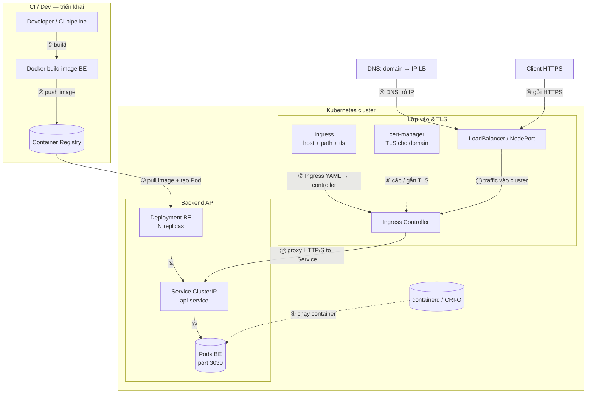

# Hệ Thống & DevOps (Interview Prep)

---

## Phần 1: Docker

### 1. Docker là gì? Giải quyết vấn đề gì?

**Docker** là nền tảng **containerization** (công nghệ container): đóng gói ứng dụng cùng thư viện, runtime, cấu hình vào một đơn vị chạy độc lập gọi là **container**.

**Vấn đề nó giải quyết:**

- **"Chạy được trên máy tôi nhưng lên server lại lỗi"** — Môi trường (OS, phiên bản runtime, thư viện) giống nhau nhờ chạy trong cùng image.
- **Cô lập ứng dụng** — Nhiều app chạy trên một máy mà không đè lên nhau (port, file, process namespace).
- **Deploy và scale nhanh** — Chạy thêm instance = chạy thêm container từ cùng image, không cần cài tay từng máy.
- **CI/CD** — Build một lần thành image, đẩy registry, kéo ra chạy ở bất kỳ môi trường nào hỗ trợ Docker.

### 2. Container khác gì VM (Virtual Machine)?


| Tiêu chí                | Container (Docker)                                  | VM (Virtual Machine)                        |
| ----------------------- | --------------------------------------------------- | ------------------------------------------- |
| **Đơn vị ảo hóa**       | Ứng dụng + runtime (process, namespace, cgroups)    | Cả OS (guest OS) chạy trên hypervisor       |
| **Kích thước**          | Nhẹ (MB), dùng chung kernel host                    | Nặng (GB), mỗi VM một OS                    |
| **Thời gian khởi động** | Giây                                                | Phút                                        |
| **Tài nguyên**          | Chia sẻ kernel host, ít overhead                    | Mỗi VM có kernel riêng, tốn RAM/CPU hơn     |
| **Isolation**           | Process/filesystem/network — mạnh nhưng cùng kernel | Cô lập phần cứng ảo — rất mạnh, khác kernel |


**Tóm tắt:** Container không chạy OS riêng, chỉ chạy process trong "hộp" (namespace + cgroups) trên kernel của host. VM chạy cả một OS ảo.

### 3. Image và Container khác nhau thế nào?

- **Image**: Bản **template read-only** — gồm filesystem (các layer) + metadata (CMD, ENTRYPOINT, env, user). Có thể build từ Dockerfile hoặc tạo từ container đang chạy. Lưu trong registry (Docker Hub, ECR, GCR…).
- **Container**: **Instance đang chạy** của một image. Có thêm writable layer trên cùng, process đang chạy, network, mount. Một image có thể tạo ra nhiều container.

Ẩn dụ: Image = file ISO/blueprint, Container = máy đang bật chạy từ bản đó.

### 4. Dockerfile là gì?

**Dockerfile** là file text chứa **các lệnh (instructions)** để Docker build ra image. Mỗi lệnh (RUN, COPY, ADD, ENV, …) thường tạo ra **một layer** trong image. Thứ tự và nội dung Dockerfile quyết định kích thước, bảo mật và hành vi của image.

Ví dụ: FROM → RUN (cài package) → COPY (code) → CMD/ENTRYPOINT (lệnh chạy khi start container).

### 5. CMD vs ENTRYPOINT

- `**CMD`**: Lệnh mặc định (và tham số) khi container chạy. Có thể **ghi đè** hoàn toàn khi `docker run ...` truyền argument (vd: `docker run myimg /bin/sh` thì CMD bị thay).
- `**ENTRYPOINT`**: Lệnh **cố định** khi container chạy. Argument của `docker run` được **nối thêm** vào ENTRYPOINT (trừ khi dùng `--entrypoint`).

**Kết hợp thường gặp:** `ENTRYPOINT ["executable"]` + `CMD ["default", "args"]` → khi run không truyền gì thì chạy executable + default args; khi truyền args thì chạy executable + args đó. CMD lúc này đóng vai default arguments cho ENTRYPOINT.

### 6. COPY vs ADD

- `**COPY`**: Chỉ **copy file/thư mục** từ host (build context) vào image. Không giải nén, không tải từ URL. Nên dùng cho code và file tĩnh.
- `**ADD`**: Copy + **thêm hành vi**: (1) URL — tải file từ mạng; (2) file local dạng `.tar*` — tự **giải nén** vào đích. Hành vi giải nén và tải URL khó đoán, ít transparent → dễ lỗi, khó cache.

**Khuyến nghị:** Ưu tiên **COPY**. Chỉ dùng ADD khi cần tải từ URL hoặc cố ý giải nén tar (và ghi rõ trong comment).

### 7. `.dockerignore` để làm gì?

**.dockerignore** hoạt động giống `.gitignore`: liệt kê file/thư mục **không** đưa vào **build context** khi chạy `docker build`. Docker client gửi toàn bộ context lên daemon; mọi thứ trong `.dockerignore` sẽ bị bỏ qua.

**Lợi ích:** Build nhanh hơn, context nhỏ hơn, tránh vô tình COPY `node_modules`, `.git`, file nhạy cảm vào image. Giảm kích thước context và rủi ro lộ secret.

### 8. Layer trong Docker image là gì?

Image Docker được tạo từ **các layer read-only** xếp chồng. Mỗi instruction trong Dockerfile (RUN, COPY, ADD, …) thường tạo **một layer**. Layer dùng **content-addressable** storage: nội dung giống nhau thì layer dùng chung (share) giữa các image → tiết kiệm dung lượng và tăng tốc pull/push.

**Đặc điểm:** Layer chỉ thêm, không sửa layer cũ. Khi build lại, từ chỗ thay đổi trở đi các layer mới được tạo lại; layer trước đó nếu không đổi thì dùng cache.

### 9. Vì sao nên đặt COPY package.json (và lock file) trước COPY . ?

Để **tận dụng cache layer**. Cài dependency (npm install, pip install, …) thường chậm và phụ thuộc vào `package.json` / `requirements.txt`. Nếu làm như sau:

1. COPY chỉ `package.json` (và lock) → RUN cài dependency → **layer này cache khi package.json không đổi.**
2. COPY toàn bộ code (`COPY . .`) → layer sau.

Khi sửa code nhưng **không** sửa dependency, Docker dùng lại layer đã cài dependency, chỉ build lại từ bước COPY code. Nếu COPY toàn bộ trước rồi mới cài, mỗi lần sửa code context đổi → cache bị vỡ → phải cài lại dependency mỗi lần build.

### 10. Multi-stage build là gì?

**Multi-stage build** là Dockerfile có **nhiều lệnh FROM**. Mỗi FROM bắt đầu một "stage" mới; chỉ stage cuối cùng (hoặc stage được chỉ định khi build) tạo ra image cuối. Các stage trước chỉ dùng để build (compiler, packager, …), không nằm trong image output.

**Lợi ích:** Image cuối **không** chứa tool build, source code, dependency dev → nhẹ và an toàn hơn. Ví dụ: stage 1 dùng image `node` chạy `npm run build`, stage 2 dùng `nginx` hoặc `node:alpine` chỉ COPY `dist/` hoặc artifact từ stage 1 rồi chạy app.

### 11. Vì sao image Node hay dùng Alpine?

**Alpine** là distro Linux rất nhỏ (vài MB), dựa trên BusyBox. Image `node:alpine` nhỏ hơn nhiều so với `node` (Debian-based).

- **Giảm size image** → pull/build nhanh, ít tốn disk và băng thông.
- **Ít package** → mặt tấn công nhỏ hơn (ít CVE hơn trong base).

**Lưu ý:** Alpine dùng **musl libc** thay vì glibc; một số native addon (C++ binding) có thể cần build riêng hoặc dùng image Debian nếu gặp lỗi tương thích.

### 12. Làm sao giảm image size?

- Dùng **base image nhỏ**: Alpine, distroless, scratch.
- **Multi-stage build**: Chỉ đưa artifact (binary, static file) vào image cuối, bỏ compiler và source.
- **Giảm layer và gộp RUN**: Ví dụ `RUN apt-get update && apt-get install -y ... && rm -rf /var/lib/apt/lists/*` trong một RUN để không tạo layer thừa chứa cache apt.
- **.dockerignore**: Tránh đưa file không cần thiết vào context và vào image (node_modules, .git, test, doc).
- Chỉ cài **package production**, không cài devDependencies vào image chạy.
- Dùng **slim/alpine variant** của image chính thức (vd. `node:18-alpine`).

### 13. Docker network là gì?

**Docker network** là cơ chế để container **giao tiếp với nhau** (và với host) qua tên container thay vì IP. Mỗi network có DNS nội bộ: container cùng network resolve tên container ra IP.

**Các driver thường dùng:**

- **bridge** (mặc định): Mạng ảo trên host, container cùng bridge nói chuyện được với nhau.
- **host**: Container dùng stack mạng của host (không có namespace mạng riêng).
- **none**: Không gán mạng.

Tạo network: `docker network create mynet`. Chạy container gắn vào: `docker run --network mynet ...`.

### 14. Port mapping hoạt động ra sao?

**Port mapping** là ánh xạ **cổng trên host** → **cổng trong container** (vd: `-p 8080:80` = host:container). Docker (trên Linux) dùng iptables NAT: traffic tới host:8080 được chuyển tiếp vào container:80. Process trong container listen trên 80; bên ngoài truy cập qua localhost:8080 (hoặc IP host:8080).

Chỉ cần map khi muốn **truy cập từ bên ngoài host**. Container nói chuyện với nhau trong cùng Docker network thì dùng cổng nội bộ (vd 80), không bắt buộc phải publish port.

### 15. `depends_on` có đảm bảo service sẵn sàng không?

**Không.** Trong Docker Compose, `depends_on` chỉ đảm bảo **thứ tự khởi động**: service B được start **sau** khi service A đã **start** (container đã chạy). Nó **không** đợi ứng dụng bên trong A đã listen port, kết nối DB xong, hay "healthy".

Để đợi service thật sự sẵn sàng cần: (1) **healthcheck** cho service (vd. `curl` HTTP), và (2) logic trong app B retry kết nối tới A, hoặc dùng tool (vd. wait-for-it, dockerize) đợi port A mở rồi mới chạy lệnh của B.

### 16. Restart policy là gì?

**Restart policy** quy định container bị **dừng** (exit, crash, host reboot) thì có được Docker **tự khởi động lại** hay không.

- **no** (mặc định): Không restart.
- **on-failure[:max-retries]**: Chỉ restart khi container exit với code khác 0, có thể giới hạn số lần.
- **always**: Bất chấp tất cả, hễ Docker daemon (hoặc Server) khởi động lại là nó sẽ cố gắng khởi động lại container này. **Điểm yếu khó chịu:** Ngay cả khi tối qua bạn đã chủ động gõ lệnh `docker stop <container>` để tắt nó đi cho nhẹ máy, thì sáng nay khi bạn Restart lại Server, con container này sẽ **tự động sống dậy và chạy tiếp** (bỏ qua lệnh stop của bạn trước đó).
- **unless-stopped**: Thông minh và "biết ý" đồ của người dùng hơn. Nó tự động restart khi app bị crash hay server reboot giống hệt `always`. **TUY NHIÊN, điểm khác biệt sống còn là:** Nếu bạn đã đích thân dùng lệnh `docker stop` để tắt nó, Docker sẽ "ghi nhớ" quyết định này. Lần tới khi Server bị reboot hoặc Docker service khởi động lại, Docker sẽ thấy *"À, chủ nhân đã cố tình tắt nó đi rồi"* và nó sẽ **NẮM IM, KHÔNG tự động khởi động lại** container đó nữa. Đây là policy được dùng nhiều nhất cho các hệ thống Production.

Dùng khi chạy service cần high availability: set `always` hoặc `unless-stopped` để container tự sống lại sau crash hoặc reboot.

### 17. Environment variable truyền vào container thế nào?

- `**-e KEY=value`** / `**--env KEY=value**`: Truyền từng biến khi `docker run`.
- `**--env-file .env**`: Truyền cả file (mỗi dòng `KEY=value`).
- Trong **Docker Compose**: `environment:` (map trực tiếp) hoặc `env_file: .env`. Có thể override bằng biến môi trường shell khi chạy `docker compose`.

Giá trị từ host có thể dùng cho config (port, DB URL); **không** nên hardcode secret trong image — dùng env hoặc secret management.

### 18. Vì sao không nên chạy container bằng root?

- **Bảo mật**: Process chạy root trong container có quyền cao; nếu bị breakout (lỗi kernel/engine) hoặc mount volume nhạy cảm thì tác hại lớn. Giảm quyền = giảm rủi ro.
- **Best practice**: Tạo user trong image (vd. `node`) và chạy app bằng user đó (`USER node`). File trong container nên có owner phù hợp để app đọc/ghi đủ, không cần root.

### 19. Docker có isolation tuyệt đối không?

**Không.** Container chia sẻ **kernel** với host. So với VM (có kernel riêng), isolation yếu hơn: lỗi kernel, namespace escape, hoặc cấu hình sai (privileged, mount host, …) có thể ảnh hưởng host hoặc container khác. Docker dùng namespace (pid, net, mount, uts, ipc, user) + cgroups để cô lập process và tài nguyên, đủ cho đa số workload nhưng không phải "hard boundary" như VM.

### 20. Debug container đang chạy?

- `**docker exec -it <container> /bin/sh`** (hoặc `/bin/bash` nếu có): Vào shell trong container đang chạy để xem file, process, env.
- `**docker logs <container>**` / `**docker logs -f ...**`: Xem stdout/stderr của process chính.
- `**docker inspect <container>**`: Xem metadata (network, mount, env, state).
- Gắn **debugger**: Map thêm port, chạy process với debug flag (vd. Node `--inspect`) rồi attach từ host hoặc IDE.

### 21. Docker có memory limit không?

**Có.** Dùng **cgroups** để giới hạn:

- `**docker run -m 512m`** hoặc `**--memory=512m**`: Giới hạn RAM.
- `**--memory-swap**`: Giới hạn RAM + swap (mặc định swap = 2× memory khi chỉ set `-m`).
- `**--cpus**` / `**--cpu-shares**`: Giới hạn CPU.

Trong Compose: `deploy.resources.limits.memory: 512M`. Container vượt limit có thể bị OOM kill (tùy cấu hình host).

### 22. Docker internals — Docker thật ra là gì bên dưới?

- **Client (docker CLI)**: Gửi lệnh qua API tới **Docker daemon (dockerd)**.
- **Docker daemon**: Build image, tạo/xóa container, quản lý network/volume. Giao tiếp với **containerd** (runtime) để tạo container.
- **containerd**: Quản lý vòng đời container, pull image, gọi **runc** (hoặc runtime khác theo OCI).
- **runc**: Tạo process trong namespace + cgroups (Linux); đây là phần "thật sự" tạo container process trên host.
- **Image**: Lưu dạng layer (content-addressable) trong storage driver (overlay2, etc.). Container = image layers + writable layer + metadata.

Tóm lại: Docker = client + daemon + containerd + OCI runtime (runc); container = process được cô lập bằng namespace + cgroups.

### 23. `docker run` thực sự làm những bước gì?

1. **Pull image** (nếu chưa có locally) từ registry.
2. **Tạo container** (filesystem = image layers + writable layer, gán network, set env, mount volume nếu có).
3. **Chạy ENTRYPOINT/CMD** trong container (process cha = process đó).
4. Gắn stdin/stdout/stderr, có thể chạy ở foreground (-it) hoặc background (-d).

Bên dưới: daemon gọi containerd → runc tạo process với namespace + cgroups, mount rootfs từ image.

### 24. Khi nào writable layer phình to?

**Writable layer** (top layer của container) phình khi có **ghi nhiều** vào filesystem trong container: log, cache, file tạm, cài package tại runtime, ghi vào thư mục không được mount volume. Mỗi lần ghi (create/update file) đều tốn thêm dung lượng ở layer này.

**Cách giảm:** Ghi ra volume (bind mount hoặc named volume), log ra stdout rồi Docker/logger thu; tránh cài package hoặc tạo file lớn trong rootfs container.

### 25. Cách copy một file từ máy vào container

- **Đang chạy:** `docker cp /path/on/host file.txt <container>:/path/inside` (hoặc ngược lại để copy từ container ra host).
- **Lúc build:** Dùng `COPY` hoặc `ADD` trong Dockerfile (file phải nằm trong build context).

`docker cp` dùng khi container đã chạy, cần đẩy/config nhanh; không nên dùng để thay thế image build chuẩn.

### 26. Các kiểu deploy (liên quan Docker)

- **Single host**: `docker run` hoặc Docker Compose trên một máy. Đơn giản, phù hợp dev hoặc app nhỏ.
- **Orchestrator**: **Kubernetes**, **Docker Swarm**, **ECS** — nhiều host, scale, rolling update, self-healing. Image Docker là đơn vị deploy.
- **Serverless/container**: AWS Fargate, Cloud Run — chạy container không quản lý server, scale theo request.
- **CI/CD**: Build image trong pipeline (Jenkins, GitLab CI, GitHub Actions), push registry, deploy bằng orchestrator hoặc pull + run trên server.

### 27. Volume (bind mount, named volume, tmpfs) khác nhau thế nào?

- **Bind mount**: Ánh xạ **một thư mục/file cụ thể trên host** vào trong container. `-v /home/user/data:/app/data`. Dữ liệu nằm ở host, container chỉ “nhìn” vào đó. Dễ backup, chỉnh sửa từ host; path host phụ thuộc máy.
- **Named volume**: Volume do Docker quản lý, lưu trong thư mục của Docker (vd. `/var/lib/docker/volumes/<tên>/_data`). `-v mydata:/app/data`. Không phụ thuộc đường dẫn host, backup/restore qua `docker volume`. Dùng cho data cần persist, chia sẻ giữa container.
- **tmpfs**: Lưu trong **RAM**, không ghi đĩa. `--tmpfs /tmp`. Mất khi container tắt. Dùng cho dữ liệu tạm, nhạy cảm không muốn lưu đĩa.

### 28. Khi nào nên dùng `docker build --no-cache`?

Khi muốn **bỏ qua toàn bộ cache layer** và build lại từ đầu. Dùng khi: (1) Dependency thay đổi nhưng file (package.json, requirements.txt) không đổi nên cache vẫn dùng layer cũ; (2) Base image đã update (security fix) cần pull và build lại; (3) Build bị lỗi lạ, nghi do cache hỏng. Nhược điểm: build chậm hơn nhiều.

### 29. BuildKit là gì?

**BuildKit** là engine build image mới (mặc định từ Docker 23.0), thay thế builder cũ. Ưu điểm: build song song, cache hiệu quả hơn (cache mount, inline cache), bỏ qua stage không dùng, syntax mới (`RUN --mount=type=cache`, `COPY --from` linh hoạt). Bật bằng `DOCKER_BUILDKIT=1` (hoặc mặc định trong bản mới). Dockerfile vẫn tương thích.

### 30. Healthcheck trong Dockerfile / Compose để làm gì?

**Healthcheck** định nghĩa lệnh kiểm tra container còn “sống” đúng nghĩa (app listen port, trả HTTP 200, …). Docker gọi lệnh đó theo chu kỳ; container có trạng thái **healthy** / **unhealthy**. Dùng cho: (1) Orchestrator (Swarm, K8s) hoặc load balancer quyết định có gửi traffic hay không; (2) `depends_on: condition: service_healthy` trong Compose; (3) Theo dõi và restart khi unhealthy. Ví dụ Dockerfile: `HEALTHCHECK --interval=30s CMD curl -f http://localhost:8080/health || exit 1`.

### 31. `docker compose` và `docker-compose` (dấu gạch ngang) khác nhau thế nào?

- `**docker compose`** (plugin, không dấu ngang): Plugin đi kèm Docker Engine, dùng file Compose V2 (phiên bản mới), tích hợp với CLI Docker. Là hướng chính thức, nên dùng.
- `**docker-compose**` (standalone, có dấu ngang): Binary cũ viết bằng Python, cài riêng. Vẫn hỗ trợ file cũ và mới nhưng không được phát triển mạnh bằng plugin.

Cú pháp file `docker-compose.yml` tương thích; khác chủ yếu ở cách gọi lệnh và phiên bản tính năng.

### 32. Push / pull image với registry private (vd. GitLab, ECR) thế nào?

- **Đăng nhập:** `docker login registry.example.com` (nhập user/password hoặc token). ECR dùng `aws ecr get-login-password | docker login ...`.
- **Tag image theo registry:** `docker tag myimg:latest registry.example.com/mygroup/myimg:latest`.
- **Push:** `docker push registry.example.com/mygroup/myimg:latest`.
- **Pull:** `docker pull registry.example.com/mygroup/myimg:latest`.

CI/CD thường login bằng token/role (service account, IAM) rồi build, tag, push.

### 33. Logging driver trong Docker là gì?

Docker ghi stdout/stderr của container theo **logging driver**. Mặc định là **json-file** (file JSON trên host). Có thể đổi thành **syslog**, **journald**, **awslogs**, **gcplogs**, **fluentd**, **none**, … để gửi log ra hệ thống tập trung. Cấu hình trong `daemon.json` (mặc định) hoặc `docker run --log-driver=... --log-opt ...`. Production thường dùng driver đẩy log ra ngoài (ELK, CloudWatch, …) thay vì giữ trong file local.

### 34. `docker system prune` làm gì? Có xóa volume không?

`**docker system prune`** xóa: container đã dừng, network không dùng, image “dangling” (không tag). **Không** xóa volume mặc định (tránh mất data). Để xóa cả volume không được container nào dùng: `docker system prune -a --volumes` (cực kỳ cẩn thận). `-a` còn xóa luôn mọi image không được container nào dùng. Dùng để giải phóng disk sau khi test/develop.

### 35. ARG và ENV trong Dockerfile khác nhau thế nào?

- **ARG**: Biến dùng **lúc build** (build-time). Truyền qua `docker build --build-arg VAR=value`. Có thể dùng trong RUN, COPY, … Không tồn tại trong image đang chạy (container không thấy ARG).
- **ENV**: Biến **có trong image và container** (runtime). Container khi chạy có biến môi trường này. Dùng cho config app (PORT, NODE_ENV, …).

Có thể dùng ENV để “ghi lại” giá trị ARG nếu cần giá trị build-time xuất hiện lúc runtime.

### 36. EXPOSE trong Dockerfile và `-p` khi `docker run` khác nhau thế nào?

- **EXPOSE**: Chỉ **khai báo** (document) port mà container lắng nghe; **không** mở port ra host. Có tác dụng gợi ý cho người dùng và cho `docker run -P` (publish tất cả port đã EXPOSE).
- `**-p hostPort:containerPort`**: Thật sự **map port** từ host vào container; traffic từ bên ngoài mới tới được. Nếu không dùng `-p` (hoặc `-P`), dù có EXPOSE thì từ host vẫn không truy cập được container qua port đó.

### 37. Làm sao xem container đang tốn bao nhiêu CPU/RAM? (`docker stats`)

`**docker stats`** (không cần tham số): Liệt kê mọi container đang chạy với % CPU, memory usage, memory limit, network I/O, block I/O. `**docker stats <container>**`: Chỉ một container. Dữ liệu realtime, lấy từ cgroups. Dùng để kiểm tra sau khi set `-m` / `--cpus` hoặc debug container ăn nhiều tài nguyên.

### 38. Overlay storage driver là gì?

**Overlay** (hoặc **overlay2**) là **storage driver** Docker dùng để lưu layer của image và writable layer của container trên filesystem host. Layer được xếp chồng (overlay); container thấy một cây thư mục thống nhất. **overlay2** dùng hardlink và copy-on-write, hiệu quả hơn overlay cũ. Driver mặc định trên nhiều distro Linux. Trên Windows/macOS Docker Desktop dùng lớp ảo hóa riêng, không phải overlay2 trực tiếp trên host.

### 39. Vì sao không nên chạy container với `--privileged`?

`**--privileged`** cho container gần như **toàn quyền** trên host (bỏ phần lớn restriction, có thể load kernel module, truy cập device). Rủi ro bảo mật rất cao: lỗi trong container hoặc bị compromise có thể ảnh hưởng toàn host. Chỉ dùng khi thật sự cần (vd. chạy Docker-in-Docker, driver đặc biệt). Ưu tiên dùng `--cap-add` cho đúng capability cần thiết thay vì mở hết privileged.

### 40. Scan image (bảo mật) làm thế nào?

- **Docker Scout** (trước đây Snyk trong Docker): `docker scout quickview <image>` — quét CVE, dependency lỗi.
- **Trivy**: `trivy image <image>` — quét vulnerability và misconfiguration.
- **docker scan** (Docker Desktop): Tích hợp Snyk.

Trong CI/CD nên chạy scan sau khi build image; fail pipeline nếu critical/high. Cập nhật base image và dependency thường xuyên để giảm CVE.

---

## Phần 2: Kubernetes

### Sơ đồ tham khảo: Deploy production **backend (BE)** — Docker image + K8s + HTTPS cho một domain

Luồng BE: **build image API (Docker) → đẩy registry → Deployment BE nhiều Pod → Service → Ingress (HTTPS) → client gọi `https://domain/api/...`**



**Thứ tự gợi ý:**

| # | Mũi tên | Ý nghĩa |
|---|---------|---------|
| ①② | Dev → build → Registry | Build image BE và đẩy lên registry. |
| ③ | Registry → Deployment | Cluster pull image, Deployment tạo/cập nhật Pod. |
| ④ | Runtime → Pod | containerd/CRI-O chạy container từ image. |
| ⑤⑥ | Deployment → Service → Pod | Service trỏ tới Pod qua label; kube-proxy/LB nội bộ. |
| ⑦ | Ingress resource → Controller | Manifest Ingress được controller đọc (routing + TLS ref). |
| ⑧ | cert-manager → Controller | Chứng chỉ TLS (Let's Encrypt hoặc Secret). |
| ⑨ | DNS → LoadBalancer | Domain resolve ra IP public của LB. |
| ⑩ | Client → LoadBalancer | Request HTTPS từ client vào cổng vào cluster. |
| ⑪ | LoadBalancer → Ingress Controller | Traffic vào đến controller (TLS có thể kết thúc ở đây). |
| ⑫ | Ingress Controller → Service | Reverse proxy theo host/path tới Service BE. |

*(Số ⑤⑥ có thể xảy ra song song hoặc trước request — Ingress chỉ cần Service & Pod đã sẵn sàng.)*

**Giải thích ngắn (chỉ BE):**

| Thành phần | Vai trò |
|------------|---------|
| **Docker / image BE** | Đóng gói API thành image; node K8s kéo image từ registry và chạy trong Pod (runtime containerd/CRI-O). |
| **Deployment BE** | Số **replica** API, rolling update; Pod chết thì tạo lại. |
| **Service** | **ClusterIP** + selector → load balance nội bộ tới các Pod BE (không expose Pod IP trực tiếp). |
| **Ingress** | Khai báo **host** (vd. `api.farme.vn` hoặc `farme.vn`) + **path** (vd. `/api`) + **tls**; Ingress Controller nhận HTTPS và forward tới `Service` BE. |
| **HTTPS** | **cert-manager** + Let's Encrypt (HTTP-01/DNS-01) hoặc Secret TLS thủ công. |
| **LoadBalancer** | IP public; DNS trỏ domain vào đó (cloud LB / MetalLB / LB ngoài cluster). |

**Tóm tắt một câu:** *Image BE (Docker) → registry → Deployment nhiều Pod API → Service → Ingress kết thúc HTTPS theo domain/path → client chỉ gọi `https://.../api/...`.*

---

### 1. Làm thế nào để Stop (Dừng) một Pod trong Kubernetes (K8s)?

Trong Kubernetes, Pod là thực thể phù du (ephemeral). Không có khái niệm "Stop/Pause rồi Start lại" y nguyên cái Pod đó như Docker Container. Bạn chỉ có thể **Xóa (Delete)** nó, và để ReplicaSet/Deployment tự động sinh ra một Pod mới thay thế (nếu có).

Tuy nhiên, có nhiều cấp độ để "dừng" hoặc "xóa" tùy theo bài toán:

#### Cách 1: Xóa Pod thông thường (Graceful Termination)

Đây là cách an toàn nhất. K8s sẽ gửi tín hiệu `SIGTERM` (mặc định cho 30 giây) để App bên trong có thời gian lưu data, đóng kết nối DB, hoàn thành nốt request đang chạy. Sau 30s nếu chưa chết, nó bồi thêm `SIGKILL`.

```bash
# Xóa 1 Pod cụ thể
kubectl delete pod <pod-name> -n <namespace>

# Xóa nhiều Pod cùng lúc theo Label
kubectl delete pod -l app=my-backend -n <namespace>
```

#### Cách 2: Xóa Ép buộc (Force Delete) - Khi Pod bị kẹt ở trạng thái Terminating

Nếu Node bị chết mạng hoặc App bị treo cứng không chịu tắt, Pod sẽ bị kẹt chữ `Terminating`. Lúc này ta phải mổ sống, không chờ 30 giây rườm rà nữa:

```bash
# Thêm cờ --force và --grace-period=0
kubectl delete pod <pod-name> -n <namespace> --force --grace-period=0
```

#### Cách 3: Muốn "Dừng hẳn" Pod mà không cho nó mọc lại (Scale down)

Nếu bạn dùng `kubectl delete pod` ở Cách 1, thì 3 giây sau Deployment controller sẽ tự động đẻ ra 1 cái Pod mới y chang vì nó cần duy trì số lượng Replicas. Nếu bạn THỰC SỰ muốn tắt hẳn con App đó nghỉ ngơi:

```bash
# Scale số lượng Pod của Deployment về con số 0
kubectl scale deployment <deployment-name> --replicas=0 -n <namespace>
```

#### Cách 4: Tắt Pod để Debug (Cô lập Pod)

Đôi khi bạn muốn con Pod "chết giả" so với người dùng nhưng thân xác nó vẫn còn để bạn chui vào bắt bug.
Bản chất K8s định tuyến Traffic vào Pod thông qua các **Label**. Bạn chỉ cần đổi Label của cái Pod đó là Route/Service sẽ lơ nó qua 1 bên (Ngưng nhận traffic).

```bash
# Xóa nhãn app=my-backend đi và thêm nhãn status=debug
kubectl label pod <pod-name> app- status=debug --overwrite
```

**Tóm tắt "Bùa hộ mệnh" đi Phỏng vấn:**

> *"Trong Kubernetes không có khái niệm Tạm dừng (Pause/Stop) Pod như Docker, mà chỉ có Xóa (Delete) đi tạo lại do tính chất phù du (ephemeral). Cách chuẩn mực là dùng `kubectl delete pod` để kích hoạt quá trình Graceful Termination (chờ 30s gửi SIGTERM đóng kết nối an toàn). Nếu Pod bị treo cứng Terminating, ta dùng cờ `--force --grace-period=0`. Còn nếu mục đích là vĩnh viễn tắt App không cho tự mọc lại, ta phải can thiệp vào tầng trên bằng lệnh `kubectl scale deployment --replicas=0`."*

