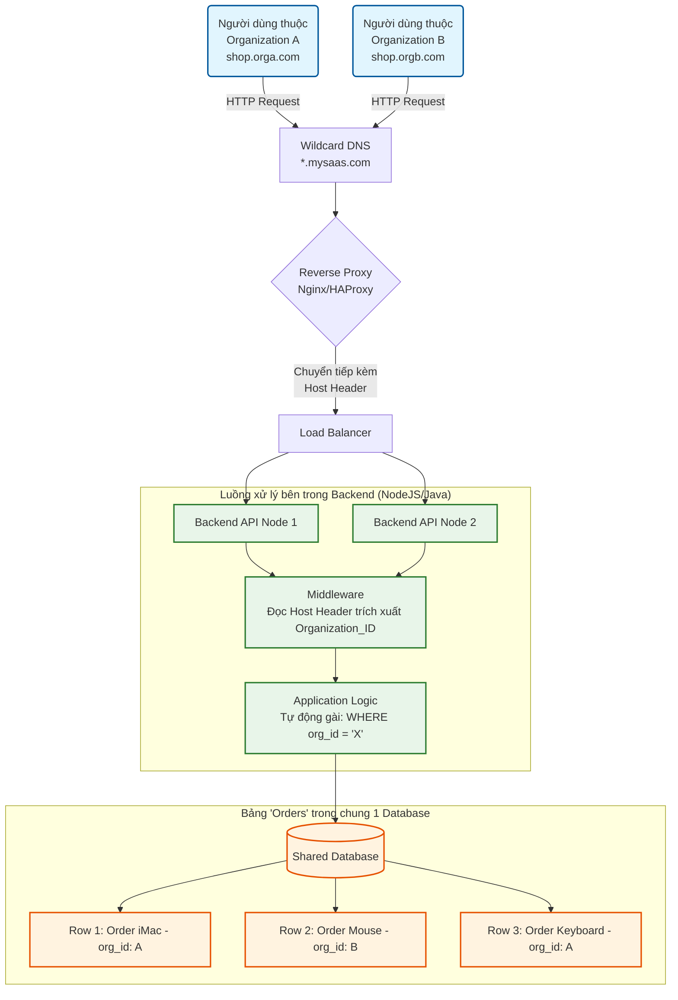

# Cẩm nang Phỏng vấn System Design (Thiết kế hệ thống)

Tài liệu này tổng hợp các concept và câu hỏi phỏng vấn hóc búa nhất về System Design và Kiến trúc phần mềm.

---

### 1. Kiến trúc Multi-Tenant (Đa khách thuê) là gì? Các mô hình triển khai phổ biến?

Đây là câu hỏi "bảo chứng" để đánh giá bạn có kinh nghiệm xây dựng các SaaS (Software as a Service) thực chiến hay không (như Slack, Shopify, Jira, Notion...).

#### 1. Khái niệm Multi-Tenancy là gì?

- **Multi-Tenant (Đa khách thuê)** là một kiến trúc phần mềm trong đó **MỘT ĐƠN PHIÊN BẢN (Single Instance)** của phần mềm chạy trên máy chủ sẽ phục vụ chung cho **NHIỀU KHÁCH HÀNG (Tenants)** khác nhau.
- Mỗi "Tenant" là một nhóm người dùng dùng chung quyền lợi với phần mềm đó (ví dụ: Mỗi công ty đăng ký xài Slack là 1 Tenant).
- Tại đây, dữ liệu của khách hàng A (Tenant A) được cách ly và bảo mật hoàn toàn vô hình đối với khách hàng B (Tenant B), dù họ đang cùng xài chung một bộ mã nguồn, chung RAM, chung CPU của máy chủ hệ thống.
- **Trái ngược với Single-Tenant:** Nơi mỗi khách hàng đăng ký, bạn lại phải copy nguyên một bộ source code và dựng lên 1 con server rỗng riêng biệt cho họ xài (rất tốn kém).

#### 2. Ba mô hình Multi-Tenant phổ biến nhất ở tầng Database

Việc dùng chung Server Code là hiển nhiên, nhưng cách "Dùng chung Database" lại là bài toán làm đau đầu mọi kỹ sư. Có 3 mô hình từ Tách Biệt cho đến Xài Cọp:

##### Mô hình A: Database per Tenant (Mỗi Tenant 1 Database Độc Lập)

- **Hoạt động:** Server dùng chung, nhưng khi khách đăng ký, hệ thống tự động gõ mã tạo hẳn một DB mới tinh (Database A cho KH A, Database B cho KH B).
- **Ưu điểm:** Cách ly dữ liệu đỉnh cao 100%. Nếu DB của khách A bị sập hoặc bị hacker tấn công, khách B hoàn toàn bình yên vô sự. Phù hợp cho khách hàng trả cực nhiều tiền để đòi hỏi bảo mật (Ngân hàng, Y tế).
- **Nhược điểm:** Cực kì tốn tiền nuôi máy chủ DB, khó bảo trì (chẳng hạn muốn thêm 1 cột vào bảng User, bạn phải chạy lệnh `ALTER TABLE` rớt mồ hôi trên 1000 cái Database của 1000 khách hàng).

##### Mô hình B: Shared Database, Separate Schema (Chung DB, Khác Schema)

- **Hoạt động:** 1000 khách hàng thì chỉ xài 1 Database duy nhất. NHƯNG hệ thống xẻ làm 1000 Schema/Namespace khác nhau. Khách A có bảng `A.Users`, `A.Orders`. Khách B có `B.Users`, `B.Orders`.
- **Ưu điểm:** Đỡ tốn kém hơn mô hình A, nhưng vẫn chia rẽ logic được dữ liệu.
- **Nhược điểm:** Vẫn khá rườm rà khi backup (sao lưu) hoặc khi nâng cấp hệ thống. Nếu con Database này sập vật lý thì toàn bộ khách hàng đều chết ngóm.

##### Mô hình C: Shared Database, Shared Schema (Chung DB, Chung luôn Bảng)

- **Hoạt động:** Mọi thứ đều chung chạ. Từ khách A đến khách Z đều nhét chung vô duy nhất một bảng `Users` và `Orders`.
- **Cách phân biệt:** Trong MỌI bảng trên toàn cõi DB, đều phải đẻ thêm một cột tên là `Tenant_ID`. Khi User A đăng nhập, code Backend phải TỰ HIỂU và tự nối đuôi thêm đoạn `WHERE Tenant_ID = 'A'` vào mọi câu lệnh Query.
- **Ưu điểm:** Rẻ vô cực, siêu tối ưu hóa tài nguyên. Thêm/Sửa tự động cho hàng triệu khách bằng 1 nút bấm (Kiến trúc chuẩn chỉ của AWS, Salesforce, Notion).
- **Nhược điểm:** Rủi ro chí mạng đến từ LẬP TRÌNH VIÊN. Chỉ cần 1 dòng code Dev quên gõ chữ `WHERE Tenant_ID`, toàn bộ cơ sở dữ liệu của khách A sẽ lộ thiên, phơi bày trần trụi trước mặt khách hàng B (Data leakage). Đòi hỏi hệ thống Unit Test và Filter phải cực kỳ kín kẽ.

**Bí quyết chốt hạ (Điểm cộng ăn tiền):**

> _"Ở các dự án thực tế, người ta không bao giờ dính cứng vào một loại đâu. Kiến trúc hỗn hợp (Hybrid) là Vua. Đa số user Tier Free hoặc Gói Rẻ sẽ bị nhét chung vào kiến trúc **Chung bảng (C)** để tiết kiệm. Trong khi những ông lớn Enterprise mua gói VIP sẽ tự động được cấp phát một **Database độc lập (A)** để hưởng trọn tốc độ và biệt lập bảo mật."_

---

### 4. Sơ đồ Kiến trúc Multi-Tenant (Mô hình Chung Database - C)

Để dễ hình dung hơn cách một hệ thống SaaS "nhồi nhét" nhiều Organization vào chung 1 Database, dưới đây là sơ đồ luồng đi của dữ liệu:

**Giải thích sơ đồ:**

1. Khách hàng truy cập vào tên miền riêng biệt. Tất cả đều hội tụ về con Nginx của chúng ta.
2. Code Backend dùng Middleware chặn lại, dựa vào tên miền để xác định `org_id` là A hay B.
3. Khi lưu hoặc lấy dữ liệu xuống cái Database khổng lồ duy nhất kia, mã Backend luông khéo léo đính kèm điều kiện lọc `org_id` để xuất chuồng đúng dữ liệu, không bị "râu ông nọ cắm cằm bà kia".
