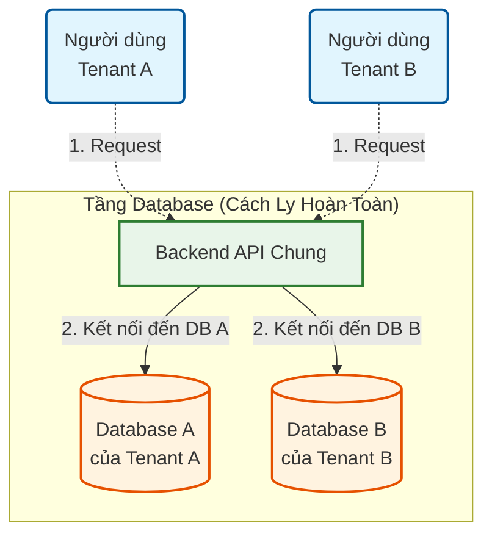
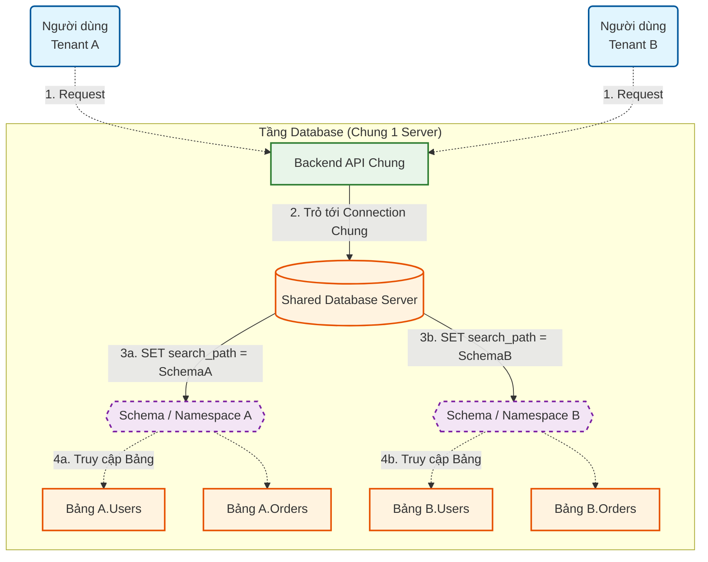
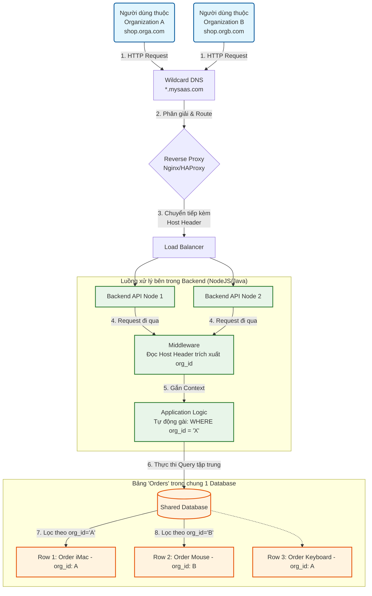

# Cẩm nang Phỏng vấn System Design (Thiết kế hệ thống)

Tài liệu này tổng hợp các concept và câu hỏi phỏng vấn hóc búa nhất về System Design và Kiến trúc phần mềm.

---

### 1. Kiến trúc Multi-Tenant (Đa khách thuê) là gì? Các mô hình triển khai phổ biến?

Đây là câu hỏi "bảo chứng" để đánh giá bạn có kinh nghiệm xây dựng các SaaS (Software as a Service) thực chiến hay không (như Slack, Shopify, Jira, Notion...).

#### 1. Khái niệm Multi-Tenancy là gì?

- **Multi-Tenant (Đa khách thuê)** là một kiến trúc phần mềm trong đó **MỘT ĐƠN PHIÊN BẢN (Single Instance)** của phần mềm chạy trên máy chủ sẽ phục vụ chung cho **NHIỀU KHÁCH HÀNG (Tenants)** khác nhau.
- Mỗi "Tenant" là một nhóm người dùng dùng chung quyền lợi với phần mềm đó (ví dụ: Mỗi công ty đăng ký xài Slack là 1 Tenant).
- Tại đây, dữ liệu của khách hàng A (Tenant A) được cách ly và bảo mật hoàn toàn vô hình đối với khách hàng B (Tenant B), dù họ đang cùng xài chung một bộ mã nguồn, chung RAM, chung CPU của máy chủ hệ thống.
- **Trái ngược với Single-Tenant:** Nơi mỗi khách hàng đăng ký, bạn lại phải copy nguyên một bộ source code và dựng lên 1 con server rỗng riêng biệt cho họ xài (rất tốn kém).

#### 2. Ba mô hình Multi-Tenant phổ biến nhất ở tầng Database

Việc dùng chung Server Code là hiển nhiên, nhưng cách "Dùng chung Database" lại là bài toán làm đau đầu mọi kỹ sư. Có 3 mô hình từ Tách Biệt cho đến Xài Cọp:

##### Mô hình A: Database per Tenant (Mỗi Tenant 1 Database Độc Lập)

- **Hoạt động:** Server dùng chung, nhưng khi khách đăng ký, hệ thống tự động gõ mã tạo hẳn một DB mới tinh (Database A cho KH A, Database B cho KH B).
- **Ưu điểm:** Cách ly dữ liệu đỉnh cao 100%. Nếu DB của khách A bị sập hoặc bị hacker tấn công, khách B hoàn toàn bình yên vô sự. Phù hợp cho khách hàng trả cực nhiều tiền để đòi hỏi bảo mật (Ngân hàng, Y tế).
- **Nhược điểm:** Cực kì tốn tiền nuôi máy chủ DB, khó bảo trì (chẳng hạn muốn thêm 1 cột vào bảng User, bạn phải chạy lệnh `ALTER TABLE` rớt mồ hôi trên 1000 cái Database của 1000 khách hàng).

##### Mô hình B: Shared Database, Separate Schema (Chung DB, Khác Schema)

- **Hoạt động:** 1000 khách hàng thì chỉ xài 1 Database duy nhất. NHƯNG hệ thống xẻ làm 1000 Schema/Namespace khác nhau. Khách A có bảng `A.Users`, `A.Orders`. Khách B có `B.Users`, `B.Orders`.
- **Ưu điểm:** Đỡ tốn kém hơn mô hình A, nhưng vẫn chia rẽ logic được dữ liệu.
- **Nhược điểm:** Vẫn khá rườm rà khi backup (sao lưu) hoặc khi nâng cấp hệ thống. Nếu con Database này sập vật lý thì toàn bộ khách hàng đều chết ngóm.

##### Mô hình C: Shared Database, Shared Schema (Chung DB, Chung luôn Bảng)

- **Hoạt động:** Mọi thứ đều chung chạ. Từ khách A đến khách Z đều nhét chung vô duy nhất một bảng `Users` và `Orders`.
- **Cách phân biệt:** Trong MỌI bảng trên toàn cõi DB, đều phải đẻ thêm một cột tên là `Tenant_ID`. Khi User A đăng nhập, code Backend phải TỰ HIỂU và tự nối đuôi thêm đoạn `WHERE Tenant_ID = 'A'` vào mọi câu lệnh Query.
- **Ưu điểm:** Rẻ vô cực, siêu tối ưu hóa tài nguyên. Thêm/Sửa tự động cho hàng triệu khách bằng 1 nút bấm (Kiến trúc chuẩn chỉ của AWS, Salesforce, Notion).
- **Nhược điểm:** Rủi ro chí mạng đến từ LẬP TRÌNH VIÊN. Chỉ cần 1 dòng code Dev quên gõ chữ `WHERE Tenant_ID`, toàn bộ cơ sở dữ liệu của khách A sẽ lộ thiên, phơi bày trần trụi trước mặt khách hàng B (Data leakage). Đòi hỏi hệ thống Unit Test và Filter phải cực kỳ kín kẽ.

**Bí quyết chốt hạ (Điểm cộng ăn tiền):**

> _"Ở các dự án thực tế, người ta không bao giờ dính cứng vào một loại đâu. Kiến trúc hỗn hợp (Hybrid) là Vua. Đa số user Tier Free hoặc Gói Rẻ sẽ bị nhét chung vào kiến trúc **Chung bảng (C)** để tiết kiệm. Trong khi những ông lớn Enterprise mua gói VIP sẽ tự động được cấp phát một **Database độc lập (A)** để hưởng trọn tốc độ và biệt lập bảo mật."_

---

### 4. Sơ đồ Kiến trúc Multi-Tenant cho cả 3 Mô hình

Để dễ hình dung hơn cách hoạt động của từng mô hình, dưới đây là sơ đồ kiến trúc và luồng dữ liệu tương ứng:

#### 4.1. Sơ đồ Mô hình A: Database per Tenant (Mỗi Tenant 1 DB)

Khách hàng dùng chung ứng dụng nhưng mỗi Tenant sở hữu một Database hoàn toàn độc lập (vật lý hoặc logic).

**Giải thích End-to-End (Mô hình A):**

1. **[1] Gửi Request:** Trình duyệt/App của Tenant A hoặc Tenant B gửi yêu cầu (Request) lên con Backend API xài chung của hệ thống. Trong Request có chứa thông tin để định danh Tenant (ví dụ: qua Domain, Token, đối số URL hoặc Header).
2. **[2] Kết nối Database độc lập:** Backend API phân tích thông tin định danh và quyết định xem phải lấy Connection String nào. Sau đó, nó thực hiện query **trực tiếp** vào con Database vật lý (hoặc logic) được cấp phát riêng rẻ và hoàn toàn độc lập của Tenant đó. Cơ sở dữ liệu của ai người đó dùng, cách ly an toàn 100%.

#### 4.2. Sơ đồ Mô hình B: Shared Database, Separate Schema (Chung DB, Khác Schema)

Sử dụng chung 1 Database vật lý để tiết kiệm tài nguyên máy chủ, nhưng chia tách không gian bằng Schema / Namespace cho từng Tenant.

**Giải thích End-to-End (Mô hình B):**

1. **[1] Gửi Request:** Các Tenant Request tới Backend API thông qua chung một bộ source code. Backend thực hiện trích xuất thông tin định danh Tenant.
2. **[2] Trỏ tới Connection Chung:** Khác với Mô Hình A, ở đây Backend API duy trì một DB Connection Pool kết nối vào chung 1 cái Server Database của hệ thống (ví dụ: chung 1 con PostgreSQL).
3. **[3] Chuyển đổi Schema:** Trước khi chạy lệnh Query, Backend sẽ ra một lệnh điều hướng cấp phiên (Session-level) để nhắc cho Database biết cần chui vào không gian của ai. (Ví dụ ở PostgreSQL là chạy lệnh `SET search_path TO "SchemaA"`).
4. **[4] Truy xuất Bảng:** Mọi lệnh Query như `SELECT * FROM Users` sẽ tự động "rơi" vào đúng thư mục lô-gic (Schema A hoặc Schema B) chứ không bị lẫn lộn vào nhau, qua đó trả về Data cho Tenant tương ứng.

#### 4.3. Sơ đồ Mô hình C: Shared Database, Shared Schema (Chung Bảng)

Mô hình phổ biến nhất dành cho các SaaS tối ưu chi phí. Dữ liệu các Tenant nằm chung một bảng và được phân biệt nhờ cột `Tenant_ID` (hay `org_id`).

**Giải thích End-to-End (Mô hình C):**

1. **[1] HTTP Request:** Người dùng của từng Organization (Organization A, Organization B) truy cập bằng Subdomain hoặc Custom Domain của riêng họ (ví dụ: `shop.orga.com`, `shop.orgb.com`).
2. **[2] & [3] Phân giải DNS và Reverse Proxy:** Hệ thống xử lý Record DNS kiểu Wildcard (`*.mysaas.com`) để route tất cả traffic về một cụm Reverse Proxy. Proxy sẽ forward Request sang một con Backend Node đang rảnh rỗi và truyền luôn `Host Header` (chứa tên miền của nhánh khách hàng).
3. **[4] Trích xuất Định danh Tenant:** Ở chốt chặn đầu tiên trên tầng Backend, `Middleware` sẽ giăng lưới chặn toàn bộ Request, phân tích `Host Header` (hoặc Auth Token) để suy ra Domain này tương ứng với `org_id` nào.
4. **[5] Gắn Context vào Logic:** Application Logic tiếp nhận yêu cầu để sinh ra câu lệnh SQL. Dựa vào `org_id` đã có, Backend sẽ tự động tiêm chuỗi `WHERE org_id = 'X'` vào Query bằng các bộ Global Filter của ORM (như Hibernate/TypeORM chặn vòng ngoài).
5. **[6] Thực thi Query Tập Trung:** Đẩy duy nhất 1 connection thực thi xuống 1 Server Database, truy vấn vào 1 bảng vật lý chứa chung tất cả dữ liệu hệ thống.
6. **[7] & [8] Lọc bản ghi chính xác:** MỌI dòng dữ liệu chia sẻ chung 1 bảng (ví dụ mảng `Orders`) và được lọc triệt để qua cột `org_id`. Bởi vì Backend đã ngầm gắn `WHERE org_id = 'A'` nên Client A chỉ nhận về thông tin thiết bị mình mua, Data leakage hoàn toàn được ngăn chặn nếu lập trình cẩn thận.
